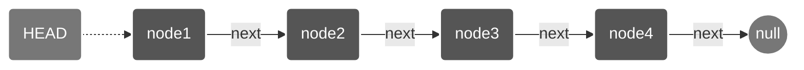
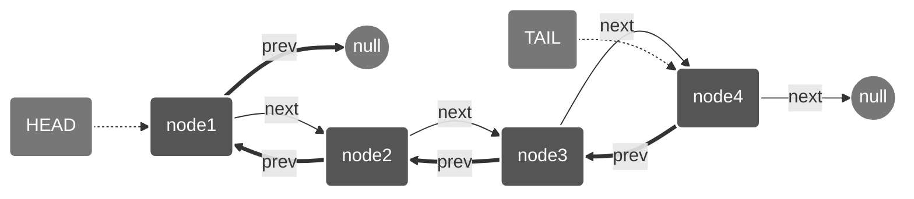
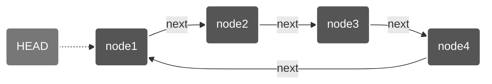
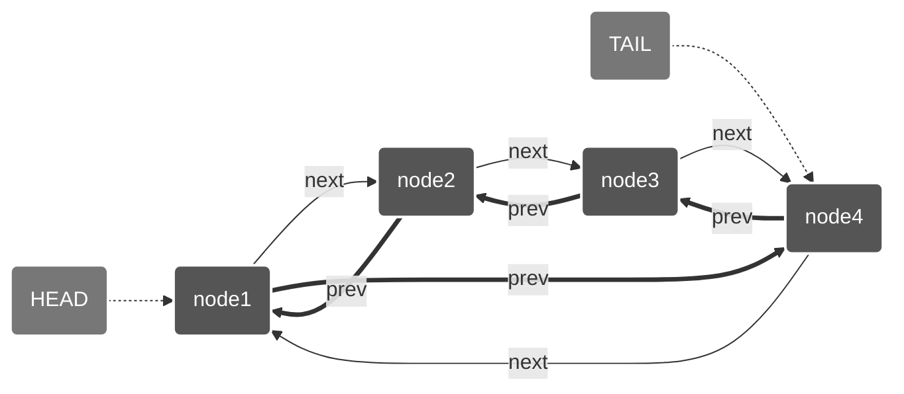
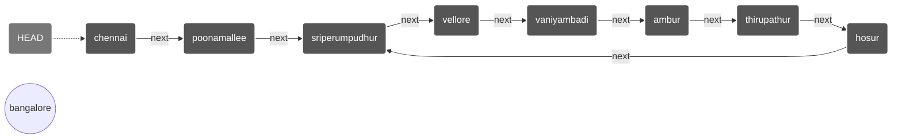

# Linked List Diagrams

## Introduction

Linked lists are fundamental data structures that store elements sequentially where each element points to the next one in the sequence. Unlike arrays, elements in linked lists are not stored in contiguous memory locations, making them dynamic and flexible for insertions and deletions.

## Types of Linked Lists

### 1. Singly Linked List

A singly linked list contains nodes that have a data field and a 'next' reference pointing to the next node in the sequence. The last node points to null.

**Key Characteristics:**

- One-directional traversal (forward only)
- Simple structure, less memory overhead
- Only requires a head pointer
- Cannot easily access previous elements

### 2. Doubly Linked List

A doubly linked list contains nodes with both 'next' and 'prev' references, allowing bidirectional traversal.

**Key Characteristics:**

- Bidirectional traversal (forward and backward)
- More memory overhead (two pointers per node)
- Usually maintains both head and tail pointers
- Easier for operations like deletion of the current node
- Can easily access both next and previous elements

### 3. Circular Linked Lists

#### 3.1 Singly Circular Linked List

A singly circular linked list is similar to a singly linked list, except that the last node points back to the first node instead of null.

**Key Characteristics:**

- No null references
- Can traverse the entire list starting from any node
- Useful for applications where you need to repeatedly go through the list
- Good for implementing round-robin scheduling algorithms

#### 3.2 Doubly Circular Linked List

A doubly circular linked list combines features of both doubly linked lists and circular linked lists.

**Key Characteristics:**

- Bidirectional circular traversal
- Most flexible type of linked list
- Higher memory overhead
- Can traverse in both directions without any null checks
- Good for applications requiring both forward and backward traversal in a loop

## Cycle Detection in Linked Lists

Detecting cycles (loops) in linked lists is an important problem in computer science. A cycle occurs when a node's next pointer points to a previous node in the list, creating an infinite loop during traversal.

### 1. Linked List Without a Cycle (Acyclic)

```mermaid
graph LR
    style head fill:#777777,stroke:#ffffff,stroke-width:2px,color:#ffffff
    style node1 fill:#555555,stroke:#ffffff,stroke-width:2px,color:#ffffff
    style node2 fill:#555555,stroke:#ffffff,stroke-width:2px,color:#ffffff
    style node3 fill:#555555,stroke:#ffffff,stroke-width:2px,color:#ffffff
    style node4 fill:#555555,stroke:#ffffff,stroke-width:2px,color:#ffffff
    style node5 fill:#555555,stroke:#ffffff,stroke-width:2px,color:#ffffff
    style node6 fill:#555555,stroke:#ffffff,stroke-width:2px,color:#ffffff
    style node7 fill:#555555,stroke:#ffffff,stroke-width:2px,color:#ffffff
    style node8 fill:#555555,stroke:#ffffff,stroke-width:2px,color:#ffffff

    head(HEAD) -.-> node1(chennai)
    node1 --next--> node2(poonamallee)
    node2 --next--> node3(sriperumpudhur)
    node3 --next--> node4(vellore)
    node4 --next--> node5(vaniyambadi)
    node5 --next--> node6(ambur)
    node6 --next--> node7(thirupathur)
    node7 --next--> node8(hosur)
    node8 --next--> node9((bangalore))
```

In this example, the list represents a path from Chennai to Bangalore with each node representing a city along the way. The list ends at Bangalore (represented as null).

### 2. Linked List With a Cycle (Cyclic)

In this example, there is a cycle where Hosur loops back to Sriperumpudhur instead of continuing to Bangalore. This creates an infinite loop when traversing the list.

### Floyd's Cycle-Finding Algorithm (Tortoise and Hare)

The most efficient way to detect a cycle in a linked list is using Floyd's Cycle-Finding Algorithm, also known as the "Tortoise and Hare" algorithm:

1. Use two pointers: slow (tortoise) and fast (hare)
2. Move slow one step at a time and fast two steps at a time
3. If there's a cycle, fast will eventually catch up to slow
4. If fast reaches null, there is no cycle

## Common Algorithms for Linked Lists

### Traversal

- Simple iteration through nodes

### Insertion

- At beginning: O(1)
- At end: O(1) with tail pointer, O(n) without
- At middle: O(1) after finding position

### Deletion

- At beginning: O(1)
- At end: O(1) with doubly linked list, O(n) with singly linked list
- At middle: O(1) after finding position

### Search

- Linear search: O(n)

### Reverse

- Iterative method
- Recursive method

### Cycle Detection

- Floyd's Cycle-Finding Algorithm (Tortoise and Hare)
- Hashing method

### Merge

- Merge two sorted linked lists

### Sort

- Merge sort for linked lists
- Insertion sort for linked lists
