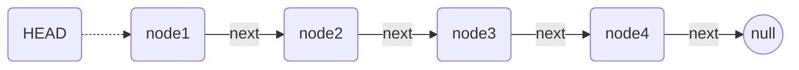
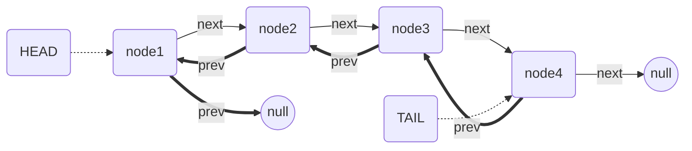
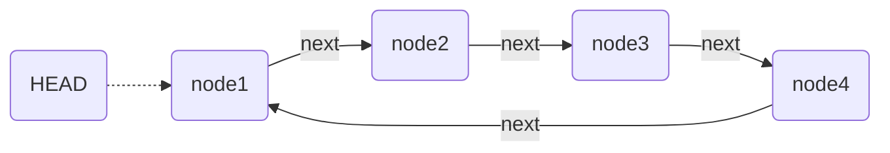
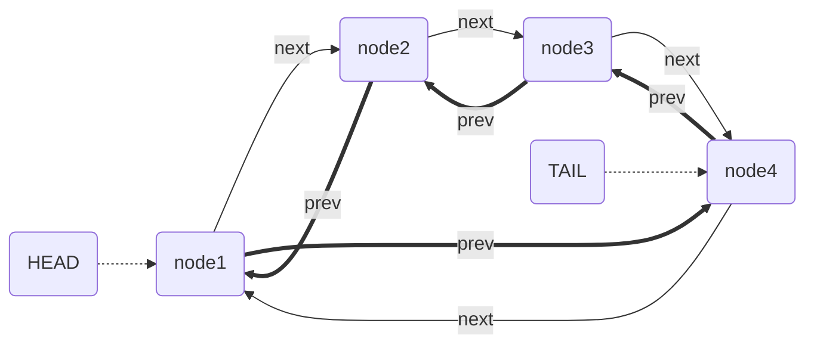
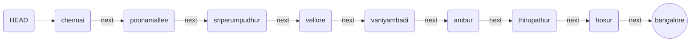
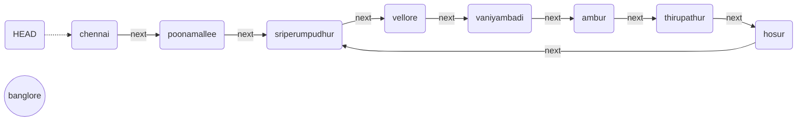

# Linked List Diagram Using Mermaid

style head fill:#f9f,stroke:#333,stroke-width:2px
style tail fill:#ff9,stroke:#333,stroke-width:2px
style null1 fill:#ccc,stroke:#000,stroke-width:1px

## Singly Linked List

## Doubly Linked List

## Circular Linked List

### Using Slingly Linked List

### Using Doubly Linked List

## Detect a cycle in a linked list

### LinkedList without a cycle

### Linked List with Cycle

