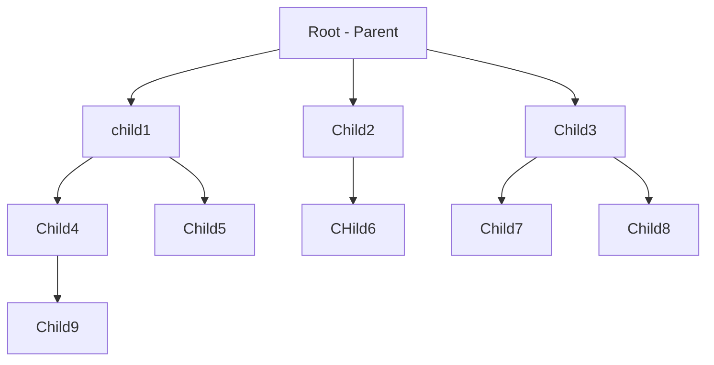
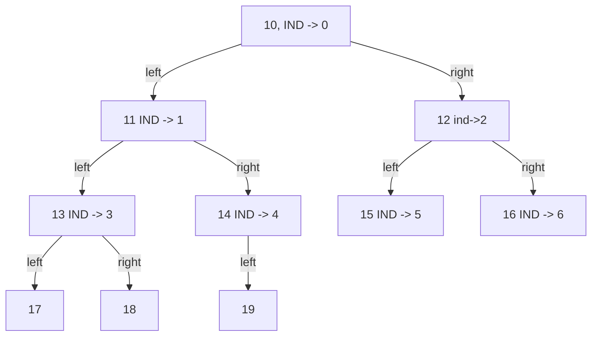
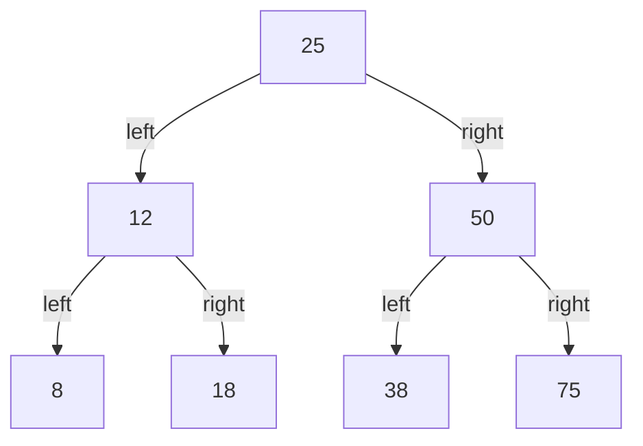
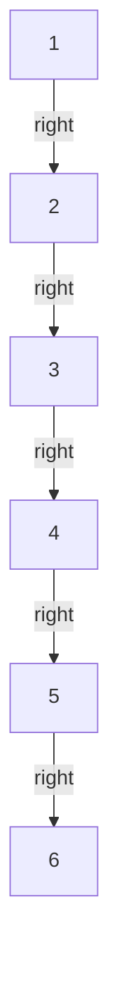
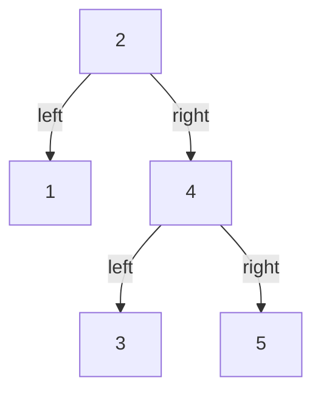
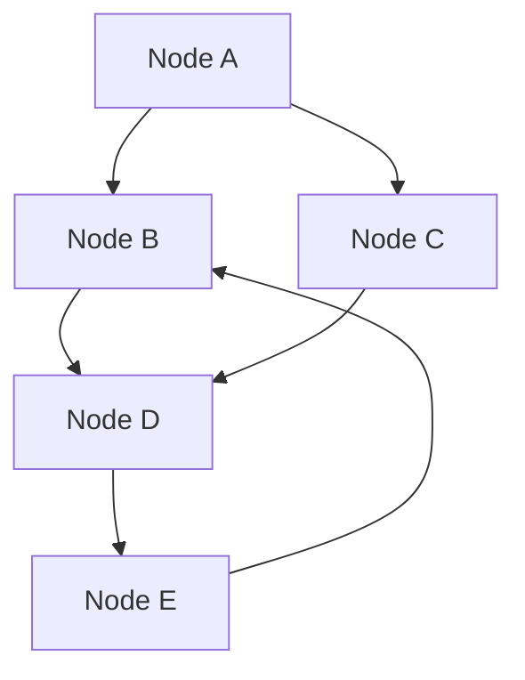

# Tree

## General Tree

## Binary Tree

## Binary Search Tree

### what is the values are sorted while inserting

### Tree Traversals

|  Type  | Pre Order |  Inorder  | postorder |
| :----: | :-------: | :-------: | :-------: |
| First  | root/Data |   left    |   left    |
| Second |   left    | root/Data |   right   |
| third  |   right   |   right   | root/Data |

## AVL Tree

> Self Balancing Binary Search Tree

## Red Black Tree

## Splay Tree

## N-ary tree
